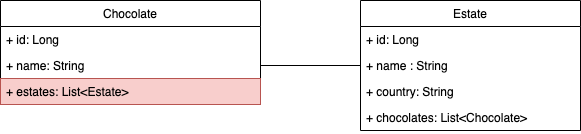

# Spring - Many to Many (Chocolates)

## Learning Objectives

* Understand the many-to-many relationship
* Be able to annotate models to set up a database schema describing a many-to-many relationship
* Be able to configure Spring to handle the join table in a many-to-many relationship
* Be able to manually configure a join table in a many-to-many relationship
* Appreciate when to let Hibernate handle the join table and when to create one manually

## Introduction

In the process of saving objects to our databse, we want to ensure that any relationships they might have to other objects are preserved. We have recently seen how we can do this to maintain a one-to-many relationship in our database by using Jpa Repository annotations correctly. 

Using the example of the Single Origin Chocolate lab we did yesterday, we could potentially query our database to discover the following:
- Given a specific estate, which chocolates contain that estate's cocoa?
- Given a specific chocolate, where does its cocoa originate from?

In reality, it is more likely that a chocolate will contain cocoa from many different estates. We are going to use the end code from yesterday's lab to model a many-to-many relationship.

> hand out this lesson's start code (which is based on the solution to the Single Origin Chocolate lab). Could be helpful to run the code & view in browser / look at the API in Postman / examine tables in Postico.

### Chocolates & Estates: Tables
Let's re-examine the objects we have and the relationships between them.

Currently, the tables in our `chocolate_db` database look like the following:

`chocolates`

| id | cocoa_percentage | name               | estate_id |
|----|------------------|--------------------|-----------|
| 1  | 70               | Salted Dark        | 1         |
| 2  | 40               | Supermilk Hazelnut | 1         |
| 3  | 72               | Ecuador Dark       | 2         |

`estates`

| id | country  | name            |
|----|----------|-----------------|
| 1  | St Lucia | Rabot Estate    |
| 2  | Ecaudor  | Hacienda Zolita |
| 3  | Ghana    | Kuapa Kokoo     |

This is a one-to-many relationship:
- One estate has many chocolates
- Many chocolates have one estate

We are now going to introduce a new type of relationship to our database. It is more likely that, as we add a wider variety of chocolate to our database, we will see a more complicated relationship between an estate and the chocolate produced from its cocoa. Most chocolate is manufactured from cocoa originating from a number of estates, making the relationship many to many:

- many chocolates have many estates
- many estates have many chocolates

This means that a foreign key representing an `estate` in `chocolates` is no longer sufficient, so how should we link the two tables together? 

Our first step should be to remove the `estate_id` property from the `chocolates` table. To illustrate our point we can also add a couple of extra chocolates that will take cocoa from several estates.

`chocolates`

| id | cocoa_percentage | name               |
|----|------------------|--------------------|
| 1  | 70               | Salted Dark        |
| 2  | 40               | Supermilk Hazelnut |
| 3  | 72               | Ecuador Dark       |
| 4  | 55               | Toffee Truffle     | // ADDED
| 5  | 55               | Praline Crunch     | // ADDED

But now the relationship between `chocolates` and `estates` seems to be lost! How can this be preserved? The answer is a **join table**, which will link `chocolates` and `estates` via foreign keys. We will call this table `chocolates_estates` and it could look like this:

`chocolates_estates`

| chocolate_id | estate_id |                                    |
|--------------|-----------|------------------------------------|
| 1            | 1         | (Salted Dark, Rabot Estate)        |
| 2            | 1         | (Supermilk Hazelnut, Rabot Estate) |
| 3            | 2         | (Ecuador Dark, Hacienda Zolita)    |
| 4            | 3         | (Toffee Truffle, Kuapa Kokoo)      |
| 4            | 2         | (Toffee Truffle, Hacienda Zolita)  |
| 5            | 1         | (Praline Crunch, Rabot Estate)     |
| 5            | 3         | (Praline Crunch, Kuapa Kokoo)      |

As you can see from this sample data, it is possible to see how a `chocolate` can have many estates (in this example `Toffee Truffle` has two cocoa from two estates: `Kuapa Kokoo` and `Hacienda Zolita`) and an `estate` can have many `chocolate`s (`Rabot Estate` produces cocoa for `Salted Dark`, `Supermilk Hazelnut` and `Praline Crunch`).

### Chocolate & Estate: The Class Diagram
We can now take another look at our class diagram. Now that we are keeping track of multiple chocolates from multiple estates, we need to alter a property in the `Chocolate` model: the `estate` property should now be a list of `Estate`s.



In summary:

A `Chocolate` could have many `estates`:
- `Chocolate` should contain a list of `Estate`s
- `Chocolate` should have something that sets up `chocolate_id` in the `chocolates_estates` join table

An `Estate` could have many `chocolates`:
- `Estate` should contain a list of `Chocolate`s
- `Estate` should have something that sets up the `estate_id` in the `chocolates_estates` table

Now we understand the relationship we are trying create, we can start to code.

### Adding and Annotating the `estates` property in `Chocolate`
Now we have agreed that many chocolates can have many estates, the `estate` property in `Chocolate` can no longer be sufficient for our needs. We need to change this property to an arraylist of `Estate`s. This new `estates` property will now need to be marked with a `@ManyToMany` annotation, as will our current list of `chocolates` in the `Estate` class.

Finally, we have to configure how to model the relationship in the RDBMS (Relational Database Management System). Typically, the 'owner' side is where we explicitly configure the relationship. But which is the 'owner' side? It might be easier to think about this using a different example.

#### A short side-tangent: students and courses
Sometimes, the 'owner' class is clear. Suppose we have a database with a table of `students` and a table of `courses`. Between these tables could exist a many-to-many relationship, where a connection could be made via a `likes` join table (where every entry in the table indicates that a student has 'liked' that course).

`students`

| id | name |
|----|------|
| 1  | Iain |
| 2  | Ed   |

`courses`

| id | course_name |
|----|-------------|
| 1  | Java        |
| 2  | Python      |

`course_likes`

| student_id | course_id |                     |
|------------|-----------|---------------------|
| 1          | 2         | (Iain liked Python) |
| 2          | 2         | (Ed liked Python)   |
| 1          | 1         | (Iain liked Java)   |

In this senario, `Student` can be considered the 'owner' class as a student will be responsible for 'liking' a course. The `Course` class would be considered the `target` class.

#### Back to estates and chocolates
Returning to chocolates and estates, we can see that there is not such a clear dynamic between our classes/tables. However, it might be possible to argue that chocolate manufacturers are responsible for choosing which estate to take cocoa from, so in this example, we will configure the relationship in `Chocolate` and consider that class the 'owner'. 

The annotation for this is `@ManyToMany` and is typically used to annotate the properties of a class (or sometimes the property's getters) that define the relationship. Usually this is a property of the type `Collection`, `List` or `ArrayList`.

> remember to replace your getters and setters for `estate` with ones for an `estates` property.

```java
// models/Chocolate.java

@Entity
@Table(name = "chocolates")
public class Chocolate{

    @Id
    @GeneratedValue(strategy = GenerationType.IDENTITY)
    @Column
    private Long id;

    // ...

    @ManytoMany     // ADDED
    private List<Estate> estates;       // MODIFIED
    
    // ...

    public List<Estate> getEstates() {  // MODIFIED
        return estates;
    }

    public void setEstates(List<Estate> estates) {  // MODIFIED
        this.estates = estates;
    }
}
```

To determine how to model the relationship in the database, we can use the `@JoinTable` annotation in the `Chocolate` class. This second annotation is used to set up the join table (`chocolates_estates`).

Next, we must also tell JPA which columns we want in the join table and a `@JoinColumn` needs to be passed to `@JoinTable` via the `joinColumns` argument. We should consider the class we are working in (`Chocolate`) when we are naming our columns (i.e. we should name the first column in the join table `chocolate_id`).

Our annotations for the `estates` property will now look like this:

```java
// models/Chocolate.java

@Entity
@Table(name = "chocolates")
public class Chocolate{

    // ...

    @ManytoMany     
    @JoinTable(     // ADDED
        name = "chocolates_estates",
        joinColumns = @JoinColumn(name = "chocolate_id")
    )
    private List<Estate> estates;       
    
    // ...
}
```

Finally, we must also map the inverse relationship with the `inverseJoinColumns` argument. From the point of view of the `Chocolate` class, this is `estate_id`.

```java
// models/Chocolate.java

@Entity
@Table(name = "chocolates")
public class Chocolate{

    @Id
    @GeneratedValue(strategy = GenerationType.IDENTITY)
    @Column
    private Long id;

    // ...

    @ManytoMany     
    @JoinTable(     
        name = "chocolates_estates",
        joinColumns = @JoinColumn(name = "chocolate_id"),
        inverseJoinColumns = @JoinColumn(name = "estate_id") // ADDED
    )
    private List<Estate> estates;       
    
    //...

}

```

It is worth remembering that although this all looks complicated, all this is doing for us is making a table in the database called `chocolates_estates` with the columns `chocolate_id` and `estate_id`. The benefit from a developer's point of view, is that the underlying SQL statements are entirely handled for us. 
   
(Bear in mind that a many-to-many relationship doesn't have an 'owner' side in the database and so technically it can be configured from either class.)

Now we have a model for the RDBMS to follow, we should also use the `@JsonIgnoreProperties` annotation to prevent our API spiraling ever deeper into the object, so as to make the data unreadable. 

The property we wish to ignore is `chocolates` (i.e. the property inside the `Estate` objects that make up part of our `Chocolate` object. In other words, bring us back a `Chocolate` object, it's list of associated `Estate`s, and that's it).

```java
// models/Chocolate.java

@Entity
@Table(name = "chocolates")
public class Chocolate{

    @Id
    @GeneratedValue(strategy = GenerationType.IDENTITY)
    @Column
    private Long id;

    // ...

    @JsonIgnoreProperties({"chocolates"})   // ADDED
    @ManytoMany     
    @JoinTable(     
        name = "chocolates_estates",
        joinColumns = @JoinColumn(name = "chocolate_id"),
        inverseJoinColumns = @JoinColumn(name = "estate_id") 
    )
    private List<Estate> estates;       
    
    //...

}

```

### Adding Estates to a Chocolate
While we are here in the `Chocolate` class, we should also create a method to add estates to our chocolate. Now that every chocolate could have an arraylist of estates (instead of a single estate), it will no longer work for an estate to be passed into a chocolate object as it is created. 

```java
// models/Chocolate.java

@Entity
@Table(name = "chocolates")
public class Chocolate{

    // ...

    public void addEstate(Estate estate){   // ADDED
        this.estates.add(estate);
    }

    //...
}

```

### Annotating the Estate class
In the `Estate` class, the `chocolates` property will also need a `@ManytoMany` annotation, along with a `mappedBy` attribute. `chocolates` in `Estate` are our 'target' side of the relationship, so we only need to provide the name of the name of the field which maps the relationship (). The relationship has already been defined in `Chocolate`, so we have no need to do so here in `Estate` as well.

It will also be helpful to have a `@JsonIgnoreProperties` annotation on the `chocolates` property.

```java
// models/Estate.java

public class Estate{
    //...

    @JsonIgnoreProperties({"estates"})  // ADDED
    @ManyToMany(mappedBy = "estates")   // ADDED
    private List<Chocolate> chocolates;

    // ..
}
```
And that's it! Our RDMS (in our case, JPA + Hibernate) now knows how to configure our new many-to-many relationship.


### Modifying our DataLoader
As a last step, we should head to our `DataLoader` to change how we create our objects (as a `Chocolate` will now expect a list of `Estate`s).

Set up your existing chocolates to take this format:

```java
// components/DataLoader.java

Chocolate saltedDark = new Chocolate("Salted Dark", 70);
        saltedDark.addEstate(rabotEstate);
        chocolateRepository.save(saltedDark);

```

**TASK**: Update the rest and add a couple of extra chocolates that take multiple estates:

- Toffee Truffle takes cocoa from Kuapa Kokoo and Hacienda Zolita
- Praline Crunch takes cocoa from Rabot Estate and Kuapa Kokoo

### Check our database
Let's run our application and have a look in Postico to see what our code has made for us.

In Postico, connect to `localhost` and select the `chocolate_db` database. We should now see three tables instead of two: `chocolates`, `estates`, and `chocolates_estates`. We can also use Postman/our browswer to see how our data is structured. We should see that some chocolates have multiple estates and that estates have several chocolates.

### CRUD with many-to-many
Ensuring that your API has CRUD functionality with many-to-many can be  tricky. READ and SHOW should still work (test them!) as will CREATE (to some extent). However, we will need to think about UPDATE and DELETE in the context of a many-to-many, as well as more considered approach to CREATE.

Let's check our CREATE routes works. Use Postman to create a `chocolate` and `estate`. Try adding 

```json
// localhost:8080/chocolates (POST)
{
    "name": "Salted Caramel",
    "cocoaPercentage": 50
}
```

```json
// localhost:8080/estates (POST)
{
    "name" : "Green Cocoa Co",
    "country" : "Ghana"
}
```

#### CREATE
Although CREATE *appears* to be working, it can be helpful to think about how our API will work in conjuction with a form in our frontend. We haven't covered frontend applications on the course yet, but we can still imagine a user inputting data into a form to create a object we need to persist to a database.

We should remember that now Chocolates and Estates are in a many-to-many relationship that a user might input one, some or none estates.

Our form would contain the expected fields of `Name of chocolate`, `Cocoa percentage`, but also a series of check boxes so that a user can choose to include any number of estates (or none). Typically, these checkboxes would contain the value of the id of the estate it represents.

> may be helpful to draw a form for students. You may wish to use the example [here](https://docs.google.com/presentation/d/1MTl6PSorrgiv4F5kxCog-SULlG4FKfcaHQo8z41sQIA/edit#slide=id.g206b11d9172_0_5)

Once our form is submitted, what data can our API expect to receive as part of this post request? We could expect something like this:

```json
    {
        "name" : "Praline Truffle",
        "cocoaPercentage" : "70",
        "estateIds" : [1, 3]
    }
```

You'll notice our CREATE route currently expects a `Chocolate`.
The object above is not strictly speaking a `Chocolate` - it has all the data we need to make a chocolate, but the `estateIds` are going to present a problem we need to deal with.

It would make sense at this point to have a DTO (Data Transfer Object) that our API recognises as an object and knows how to deal with. This object is not like our POJO classes as it will not be saved to the database. It is simply an object we will use to move data around our application.

Let's create a DTO model, based on a Chocolate: `New` > `Java Class` > `ChocolateDTO`.

```java
// models/ChocolateDTO.java

public class ChocolateDTO {

    private String name;
    private int cocoaPercentage;
    private List<Long> estateIds;

    public ChocolateDTO(String name, double cocoaPercentage, List estateIds){
        this.name = name;
        this.cocoaPercentage = cocoaPercentage;
        this.estateIds = estateIds;
    }

    public ChocolateDTO(){

    }
    // GETTERS & SETTERS
}
```
Let us now look at our CREATE route and amend the code to expect a `ChocolateDTO` rather than a `Chocolate`.

```java
// controllers/ChocolateController.java

// ...
// CREATE
@PostMapping
public ResponseEntity<List<Chocolate>> postChocolate(@RequestBody ChocolateDTO chocolateDTO){   // MODIFIED
    chocolateService.saveChocolate(chocolateDTO);   // MODIFIED
    return new ResponseEntity<>(chocolateService.findAllChocolates(). HttpStatus.CREATED);
}
```

It's not enough to tell our application to expect this new object (our `ChocolateDTO`), we will need to tell it explicitly what to do with it in the `ChocolateService`, where our `saveChocolate()` method will require a few more steps.

* We will need a new `Chocolate` object, formed using the data from our `chocolateDTO`. 
* We will also need to find the required `estate` objects from our database to add to the new `chocolate`. Note that `findById` returns an `Optional` so we will need to call `get()` to extract our `Estate` object.
* Since we are accessing the `EstateRepository` for this, we will need to autowire one in.
* We can subsequently call our `addEstate` method on our new `chocolate` object to add these found estates to our object.

```java
// services/ChocolateService.java

@Autowired  // ADDED
EstateRepository estateRepository;  // ADDED

// ...

public void saveChocolate(ChocolateDTO, chocolateDTO){ // MODIFIED
    Chocolate chocolate = new Chocolate(chocolateDTO.getName(),  chocolateDTO.getCocoaPercentage()); // ADDED
    for (Long estateId : chocolateDTO.getEstateIds() ){ //ADDED
        Optional<Estate> estate = estateRepository.findById(estateId).get();
        chocolate.addEstate(estate);
    }
    chocolateRepository.save(chocolate);
}
```

Test this route using Postman. It is worthwhile checking that the route works for one, some and none estates.

```json
// Sample
// POST localhost:8080/chocolates
{
    "name": "Bounty",
    "cocoaPercentage": 30,
    "estateIds" : [3, 1]
}
```

You will also be able to see that the link is made via Chocolate and Estate (check `GET localhost:8080/estates` to see your new chocolates linked to that/those estate(s)).


#### UPDATE
Now we can create a `Chocolate` and/or an `Estate`, we can consider that we may or may not know what estates to add to chocolates (and vice versa). This information might not be available when the object is created or might change over time.

We should have an edit route that allows a user to make these changes. Once again, we can use our `chocolateDTO` to help handle these changes.

First we should create an UPDATE route that expects a `ChocolateDTO`.

```java
// controllers/ChocolateController.java

// ...

@PutMapping(value = "/{id}")    // ADDED
public ResponseEntity<Chocolate> updateChocolate(@RequestBody ChocolateDTO chocolateDTO, @PathVariable Long id){
    chocolateService.updateChocolate(chocolateDTO, id);
    return new ResponseEntity<>(chocolate, HttpStatus.OK);
}

```

We have referred to a method in `chocolateService` we, as yet, do not have: `updateChocolate()`. Let's make this in `ChocolateService`.  `updateChocolate()` will take the data in our DTO and use it to change properties and persist these changes to the database.

```java
// services/ChocolateService.java

// ...

public Chocolate updateChocolate(ChocolateDTO chocolateDTO, Long id){ // ADDED
    Chocolate chocolateToUpdate = chocolateRepository.findById(id).get();
    chocolateToUpdate.setName(chocolateDTO.getName());
    chocolateToUpdate.setCocoaPercentage(chocolateDTO.getCocoaPercenage());
    // remove all existing estates
    chocolateToUpdate.setEstates(new Arraylist<Estate>());
    // find and add estates
    for (Long estateId : chocolateDTO.getEstateIds()){
            Estate estate = estateRepository.findById(estateId).get();
            chocolateToUpdate.addEstate(estate);
        }
    chocolateRepository.save(chocolateToUpdate)
    return chocolateToUpdate;
}

```
Test your route in Postman!

#### (Optional) TASK
A corresponding route should also be written for an `Estate`. 
Write an UPDATE route in `EstateController` which calls an `updateEstate` method in `EstateService` to handle any changes.

#### DELETE (Chocolate)
Again, with many-to-many, our DELETE route needs to consider the relationships between our tables. First, we should create a DELETE route in our `ChocolateController`, with a view to having a method in our `chocolateService` to handle the process.

```java
// controllers/ChocolateController.java

@DeleteMapping(value = "/{id}")
public ResponseEntity<Long> deleteChocolate(@PathVariable Long id){
    chocolateService.deleteChocolate(id);
    return new ResponseEntity<>(id, HttpStatus.OK);
}

```
Handling the delete of a `chocolate` is straightforward enough: 

```java
// services/ChocolateService.java

public void deleteChocolate(Long id){
    chocolateRepository.deleteById(id);
}
```

As always, test your route in Postman!

#### DELETE (Estate)
But what happens if you try to delete an `Estate`? This is not so straightforward as we have a relationship between the tables `chocolates` and `estates`. We can delete a `Chocolate` straightfowardly as it is the 'owning' class, but this is not the case for `Estate`. 

To delete an estate we have to loop through the chocolates that estate supplies cocoa for and remove the estate from that chocolate.

We can begin with a DELETE route in our EstatesController. This route will call a yet-to-be-written method `removeEstatesFromChocolates`.

```java
// controllers/EstateController.java

// ...

@DeleteMapping(value = "/{id}")
public ResponseEntity<Long> deleteEstate(@PathVariable Long id){
    estateService.removeEstatesFromChocolates(id);
    return new ResponseEntity<>(id, HttpStatus.OK);
}

```

```java
// services/EstateService.java

// ...

public void removeEstatesFromChocolates(Long id){
    Estate foundEstate = estateRepository.getById(id);
    for (Chocolate chocolate : foundEstate.getChocolates()) {
        chocolate.removeEstate(foundEstate);
    }
}

```


### Explicitly including a third table
There are a couple of ways the join table can be handled, and what we choose to do depends on how our data is structured. 

In our example above, we have allowed Hibernate to create our join table. We do not need to do anything other than properly annotate the relevant POJO classes. This is fine, if all we want to have in our join table are a couple of foreign keys.

Let's suppose we want our `chocolates_estates` table to contain something beyond just an `estate_id` and a `chocolate_id`. It could be useful for us to know what percentage of that chocolate's cocoa come from which estate. 

We could no longer ask Hibernate to create the table and would need to create a separate class that deals with it explicitly. A good way to manage this many-to-many relationship is to break down it down into two one-to-manys.

If you think you will need any extra properties in a join table for your project, please speak to a trainer before-hand.
